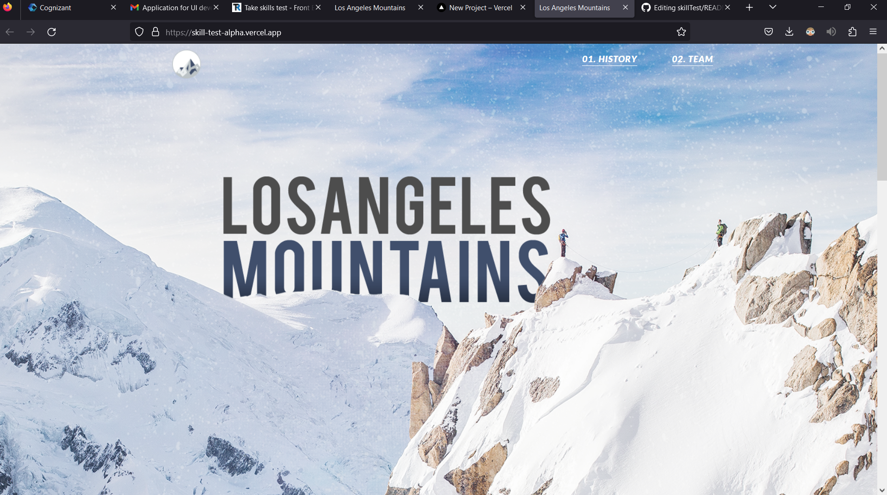

## Description
I was tasked with converting a PSD design to HTML. After extracting the images from the provided file, I followed instructions to ensure the website would be fully responsive. Specifically, when viewed on a mobile screen, the carousel was required to convert into an accordion. To accomplish this, I utilized a responsive carousel snippet from bootsnipp.com and implemented the accordion functionality using Bootstrap.

[Link to deployed Application](https://skill-test-alpha.vercel.app/)

## Table of Contents

[Technologies](#technologies) 
[Usage](#usage) 
[Credits](#credits) 
[Questions](#questions) 

---

## Technologies

- HTML
- CSS
- JavaScript
- Bootstrap

## Usage

## Credits

Carousel - "Bootstrap 4 Carousel" Snippet by mushkaa https://bootsnipp.com/snippets/exVWQ
Bootstrap for accordian

## Questions :question:

For further questions on this project or future collaboration contact me at: 

- GitHub: [rajeshg0ud](https://github.com/rajeshg0ud)
- Email: budidirajeshgoud@gmail.com
- Repository link: [skillTest](https://github.com/rajeshg0ud/skillTest)
